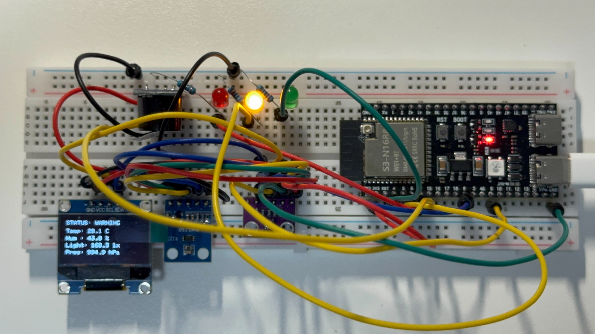

# ESP32 Study Environment Monitor

An ESP32-S3 embedded system that monitors **temperature, humidity, atmospheric pressure, and ambient light**, then converts sensor data into an immediate **GOOD / WARNING / POOR** study-environment status.

The system combines multiple I²C devices, an OLED dashboard, three status LEDs, state-aware hysteresis, non-blocking timing, runtime sensor validation, and transition-based audible alerts in one working physical prototype.



**Project links:** [Demo Video](docs/demo/esp32-study-environment-monitor-demo.mp4) · [Hardware Validation](docs/TESTING.md) · [Hardware Wiring](docs/WIRING.md)

## Project Overview

Instead of only displaying raw environmental measurements, this project converts sensor data into actionable local feedback.

The ESP32 periodically reads the physical environment, validates the sensor data, classifies the current conditions, updates the OLED display, changes the active status LED, and generates a short audible alert when the environment transitions into a POOR state.

| Feature | Implementation |
|---|---|
| Temperature | BME280 |
| Humidity | BME280 |
| Atmospheric pressure | BME280 |
| Ambient light | BH1750 / GY-302 |
| Local dashboard | 128×64 SSD1306 OLED |
| Visual feedback | Green / Yellow / Red LEDs |
| Audible feedback | Active buzzer module |
| Controller | ESP32-S3 |
| Firmware | Arduino C++ |
| Build system | PlatformIO |
| Communication | Shared I²C bus + Serial |
| Runtime timing | Non-blocking `millis()` scheduling |
| Status stability | State-aware hysteresis |
| Runtime validation | Finite-value and range checks |
| Fault response | Fail-safe WARNING / SENSOR ERROR state |

## System Architecture

```text
        BME280
 Temp / Hum / Pressure
            |
            | I²C
            v
        +---------+
        | ESP32-S3|<------ BH1750
        +---------+        Ambient Light
            |
            v
     Sensor Validation
            |
            v
   Environment Evaluation
       + Hysteresis
            |
     +------+------+
     |      |      |
     v      v      v
   GOOD   WARNING  POOR
     |      |      |
   Green  Yellow   Red
    LED     LED    LED
                   +
              Buzzer Alert

            |
            +----------> SSD1306 OLED
            |
            +----------> Serial Monitor
```

Three peripheral devices operate simultaneously on the shared I²C bus:

```text
BH1750       -> 0x23
SSD1306 OLED -> 0x3C
BME280       -> 0x76
```

The firmware also attempts `0x77` as a fallback BME280 address.

Detailed physical connections are documented in [`docs/WIRING.md`](docs/WIRING.md).

## Environment Classification

The firmware uses configurable prototype thresholds with **state-aware hysteresis**.

These thresholds were selected for system development and repeatable hardware testing. They are **engineering heuristics**, not medical or occupational-health standards.

### GOOD State

To enter `GOOD`, all three actionable measurements must satisfy the stricter entry range:

| Measurement | Enter GOOD | Remain GOOD |
|---|---:|---:|
| Temperature | 19–29 °C | 18–30 °C |
| Humidity | 35–65% | 30–70% |
| Ambient light | ≥ 330 lx | ≥ 300 lx |

This prevents small measurement fluctuations near the GOOD boundary from repeatedly switching the system between `GOOD` and `WARNING`.

### POOR State

The system enters `POOR` when any actionable measurement crosses a severe-condition threshold:

| Measurement | Enter POOR | Recover from POOR |
|---|---:|---:|
| Temperature | < 15 °C or > 32 °C | 16–31 °C |
| Humidity | < 20% or > 80% | 25–75% |
| Ambient light | < 50 lx | ≥ 70 lx |

Once the system enters `POOR`, all required measurements must return to their recovery ranges before the system can leave the POOR state.

Conditions that are neither GOOD nor POOR are classified as `WARNING`.

Pressure is measured and displayed but is not currently used in the study-status classification because it provides less immediately actionable indoor feedback than temperature, humidity, and lighting.

## Runtime Sensor Validation

Before environment classification, the firmware checks the live readings for invalid numerical values and broad validation-range violations.

The validation stage checks:

```text
Temperature -> finite and within -40 to 85 °C
Humidity    -> finite and within 0 to 100 %
Pressure    -> finite and within 300 to 1100 hPa
Light       -> finite and >= 0 lx
```

All required sensor modules must also have initialized successfully.

When the readings pass validation:

```text
Sensor validation: PASS
```

the system proceeds with normal GOOD / WARNING / POOR classification.

If validation fails at runtime, the firmware does not allow the system to report a false GOOD condition. It forces the output into a fail-safe warning state:

```text
Sensor validation: FAILED
Fail-safe: forcing WARNING state.
Status: WARNING (SENSOR ERROR)
```

The OLED displays:

```text
STATUS: SENSOR ERROR
```

This behavior was physically validated using temporary software fault injection and then removed from the final firmware.

## Physical Outputs

The environment status directly controls the three LEDs:

```text
GOOD    -> Green LED
WARNING -> Yellow LED
POOR    -> Red LED
```

The buzzer uses **state-transition-based alerting**.

When the environment transitions into POOR, the buzzer produces one short approximately 200 ms alert.

It does not continuously sound while the environment remains POOR.

Once conditions recover and the system later enters POOR again, the alert is re-armed and triggers once again.

The buzzer timing is non-blocking.

## ESP32 Pin Map

| Function | ESP32-S3 GPIO |
|---|---:|
| Green LED | GPIO 4 |
| Yellow LED | GPIO 5 |
| Red LED | GPIO 6 |
| Buzzer | GPIO 7 |
| I²C SDA | GPIO 8 |
| I²C SCL | GPIO 9 |

Each LED uses a current-limiting resistor before returning to the common ground rail.

The complete module and breadboard mapping is available in [`docs/WIRING.md`](docs/WIRING.md).

## Real Hardware Validation

The system has been tested on the physical breadboard rather than only compiled in software.

| Test | Verified Result |
|---|---|
| Normal room lighting (~120–170 lx in captured tests) | `WARNING`, yellow LED |
| BH1750 completely covered | `POOR`, red LED |
| Enter POOR state | Buzzer sounds once |
| Remain in POOR state | Red LED remains on; buzzer stays silent |
| Recover and later enter POOR again | Buzzer re-arms and sounds once again |
| POOR with light between 50–70 lx | Remains `POOR` |
| POOR with light raised above 70 lx | Recovers to `WARNING` |
| Light raised to ≥ 330 lx with other values valid | Enters `GOOD`, green LED |
| GOOD with light between 300–330 lx | Remains `GOOD` |
| GOOD with light reduced below 300 lx | Returns to `WARNING` |
| OLED output | Live temperature, humidity, light, pressure, and status displayed |
| Shared I²C bus | BME280, BH1750, and OLED detected and operating together |
| Runtime sensor validation | Valid readings accepted |
| Injected invalid light reading | Sensor error detected and fail-safe state entered |
| Recovery after fault removal | Normal validation and classification restored |
| Non-blocking firmware | Sensor updates and buzzer timing verified on hardware |

One final-firmware low-light observation was:

```text
Temperature: 27.00 C
Humidity: 50.41 %
Pressure: 994.59 hPa
Light: 25.00 lx
Sensor validation: PASS
Status: POOR
```

After increasing illumination:

```text
Temperature: 27.01 C
Humidity: 51.36 %
Pressure: 994.59 hPa
Light: 160.83 lx
Sensor validation: PASS
Status: WARNING
```

This confirmed that the POOR-to-WARNING hysteresis behavior remained operational after runtime sensor validation was added.

Detailed repeatable test evidence is documented in [`docs/TESTING.md`](docs/TESTING.md).

## Firmware Design

The firmware separates major responsibilities into dedicated functions:

| Function | Responsibility |
|---|---|
| `shouldEnterPoor()` | Detects severe conditions that require POOR |
| `hasRecoveredFromPoor()` | Determines whether POOR recovery margins are satisfied |
| `shouldEnterGood()` | Applies the stricter GOOD entry thresholds |
| `shouldRemainGood()` | Applies the wider GOOD hold thresholds |
| `evaluateEnvironment()` | Produces the state-aware GOOD / WARNING / POOR result |
| `isTemperatureValid()` | Validates temperature data |
| `isHumidityValid()` | Validates humidity data |
| `isPressureValid()` | Validates pressure data |
| `isLightValid()` | Validates ambient-light data |
| `areSensorReadingsValid()` | Combines runtime sensor-integrity checks |
| `updateStatusLeds()` | Updates the green, yellow, and red LEDs |
| `updateBuzzer()` | Handles transition-based, non-blocking audible alerts |
| `statusToString()` | Provides a common status representation for Serial and OLED output |

This separation keeps sensor acquisition, validation, environment evaluation, physical outputs, and alert behavior easier to understand and modify than placing all logic directly inside `loop()`.

## Non-Blocking Runtime Design

Sensor updates are scheduled using `millis()` rather than a blocking `delay(2000)` in the main loop.

```text
Sensor update interval -> 2000 ms
Buzzer pulse duration  -> 200 ms
```

The buzzer also uses a timestamp and active-state flag instead of pausing the processor for the duration of the alert.

This allows the main loop to remain responsive while timed behavior is active.

## Engineering Decisions

### Shared I²C Bus

The BME280, BH1750, and SSD1306 OLED share one SDA/SCL pair.

This reduces GPIO usage and demonstrates integration of multiple independent devices on the same communication bus.

### State-Aware Hysteresis

A sensor reading close to a classification threshold can fluctuate slightly from one measurement to the next.

Using separate entry, hold, and recovery boundaries prevents minor measurement changes from causing rapid GOOD/WARNING/POOR state switching.

### Transition-Based Alerting

A continuous alarm would create unnecessary noise whenever a POOR condition persisted.

The firmware therefore stores state across loop iterations and triggers the buzzer only when the environment transitions into POOR.

### Runtime Fail-Safe Behavior

Sensor initialization alone does not guarantee that every future reading remains valid.

The firmware therefore performs validation during normal operation and forces a SENSOR ERROR warning state if the live data becomes invalid.

This prevents corrupted sensor data from being interpreted as a healthy study environment.

### Actionable Measurements

Temperature, humidity, and ambient light are used for study-condition classification.

Atmospheric pressure is still measured, displayed, and included in runtime sensor-integrity validation, but it does not directly affect the GOOD / WARNING / POOR environment classification.

### Scope Control

An earlier sound-sensing concept was intentionally removed from the final feature set.

Raw sound level was not considered a reliable indicator of study-environment quality for the intended use case because legitimate activities such as music could produce misleading alerts.

The final system therefore prioritizes measurements that map more directly to actionable environmental feedback.

## Build

This project uses PlatformIO with the Arduino framework.

If the PlatformIO CLI is available:

```bash
pio run
pio run -t upload
pio device monitor -b 115200
```

The project can also be built, uploaded, and monitored through the PlatformIO controls in VS Code.

Dependencies are defined in `platformio.ini`:

```text
Adafruit BME280 Library
BH1750
Adafruit SSD1306
```

## Development Evidence

Selected public engineering evidence is intentionally organized rather than uploading every intermediate development screenshot.

```text
docs/
├── TESTING.md
├── WIRING.md
└── images/
    └── hardware-warning-state.jpg
```

- [`docs/TESTING.md`](docs/TESTING.md) records physical validation, hysteresis testing, runtime validation, fault injection, and non-blocking behavior.
- [`docs/WIRING.md`](docs/WIRING.md) records the logical GPIO mapping, shared I²C topology, module connections, and prototype breadboard coordinates.
- `docs/images/` contains selected physical prototype evidence.

## Development Note

AI-assisted tools were used during development for debugging support, code review, and iteration.

Hardware integration, wiring changes, physical tests, observed-result verification, and final implementation decisions were performed and validated on the physical prototype.

## Current Status

The core embedded system, robustness features, and engineering documentation are operational:

```text
BME280 sensing               PASS
BH1750 sensing               PASS
Shared I²C bus               PASS
OLED dashboard               PASS
Three-state LEDs             PASS
Transition-based buzzer      PASS
Non-blocking runtime         PASS
State-aware hysteresis       PASS
Runtime sensor validation    PASS
Sensor-error fail-safe       PASS
Physical fault injection     PASS
Hardware validation document PASS
Hardware wiring document     PASS
Physical prototype           PASS
```

Light-threshold hysteresis has been directly exercised on the physical prototype.

Temperature and humidity hysteresis are implemented in firmware but have not yet been physically driven through every entry, hold, and recovery boundary. This limitation is preserved explicitly so that the repository does not claim testing that was not performed.

## Future Extensions

The core project is complete. Potential extensions include:

| Extension | Purpose |
|---|---|
| Final hero-quality project photo | Improve project presentation |
| Short hardware demonstration video | Show state transitions and outputs quickly |
| Automatic sensor reinitialization | Attempt recovery after persistent sensor faults |
| Data logging | Preserve environmental measurements over time |
| Enclosure or custom PCB | Move beyond the breadboard prototype |
