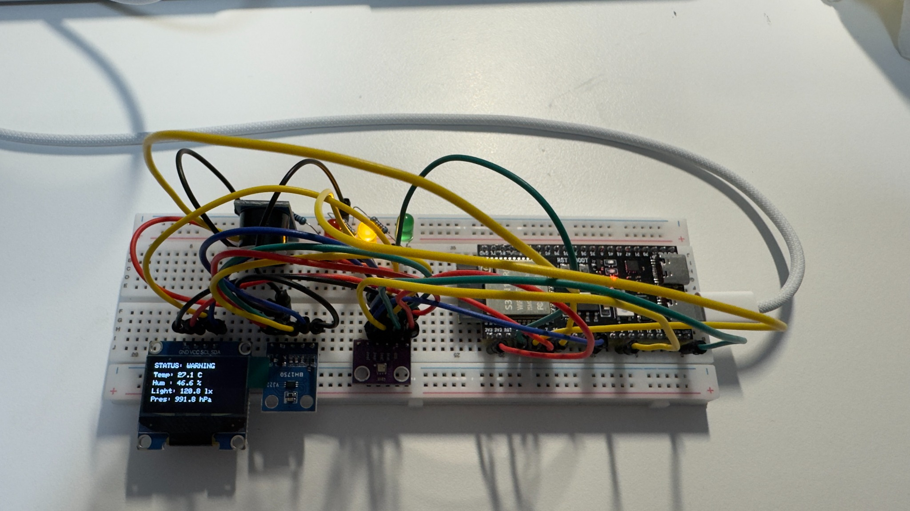

# ESP32 Study Environment Monitor

An ESP32-S3 embedded system that monitors **temperature, humidity, atmospheric pressure, and ambient light**, then converts sensor data into an immediate **GOOD / WARNING / POOR** study-environment status.

The system combines multiple I²C sensors, an OLED dashboard, three status LEDs, state-aware hysteresis, and a transition-based buzzer alert into one working physical prototype.



## Project Overview

Instead of only displaying raw environmental measurements, this project converts sensor data into actionable feedback.

The ESP32 continuously reads the environment, classifies the current conditions, updates the OLED display, changes the active status LED, and generates a short audible alert when the environment transitions into a POOR state.

| Feature | Implementation |
|---|---|
| Temperature | BME280 |
| Humidity | BME280 |
| Atmospheric pressure | BME280 |
| Ambient light | BH1750 / GY-302 |
| Local dashboard | 128×64 SSD1306 OLED |
| Visual feedback | Green / Yellow / Red LEDs |
| Audible feedback | Active buzzer module |
| Controller | ESP32-S3 |
| Firmware | Arduino C++ |
| Build system | PlatformIO |
| Communication | Shared I²C bus + Serial |
| Runtime timing | Non-blocking `millis()` scheduling |
| Status stability | State-aware hysteresis |

## System Architecture

```text
        BME280
  Temp / Hum / Pressure
            |
            | I2C
            v
         ESP32-S3
            ^
            | I2C
            |
         BH1750
       Ambient Light

            |
            v

   Environment Evaluation
      + Hysteresis

            |
     +------+------+
     |      |      |
     v      v      v
   GOOD   WARNING  POOR
     |      |      |
   Green  Yellow   Red
    LED     LED    LED
                   +
               Buzzer Alert

            |
            v

      SSD1306 OLED
      Serial Monitor
```

Three devices share the same I²C bus:

```text
BH1750       -> 0x23
SSD1306 OLED -> 0x3C
BME280       -> 0x76
```

The firmware also attempts `0x77` as a fallback BME280 address.

## Environment Classification

The firmware uses configurable prototype thresholds with **state-aware hysteresis**.

These thresholds were selected for system development and repeatable hardware testing. They are **engineering heuristics**, not medical or occupational-health standards.

### GOOD State

To enter `GOOD`, all three actionable measurements must satisfy the stricter entry range:

| Measurement | Enter GOOD | Remain GOOD |
|---|---:|---:|
| Temperature | 19–29 °C | 18–30 °C |
| Humidity | 35–65% | 30–70% |
| Ambient light | ≥ 330 lx | ≥ 300 lx |

This prevents small measurement fluctuations near the GOOD boundary from repeatedly switching the system between `GOOD` and `WARNING`.

### POOR State

The system enters `POOR` when any measurement crosses a severe-condition threshold:

| Measurement | Enter POOR | Recover from POOR |
|---|---:|---:|
| Temperature | < 15 °C or > 32 °C | 16–31 °C |
| Humidity | < 20% or > 80% | 25–75% |
| Ambient light | < 50 lx | ≥ 70 lx |

Once the system enters `POOR`, all required measurements must return to their recovery ranges before the system can leave the POOR state.

Conditions that are neither GOOD nor POOR are classified as `WARNING`.

Pressure is measured and displayed but is not currently used in the study-status classification because it provides less immediately actionable indoor feedback than temperature, humidity, and lighting.

If a required environmental sensor is unavailable during initialization, the system falls back to `WARNING` instead of reporting a false `GOOD` state.

## Physical Outputs

The environment status directly controls the three LEDs:

```text
GOOD    -> Green LED
WARNING -> Yellow LED
POOR    -> Red LED
```

The buzzer uses **state-transition-based alerting**.

When the environment transitions into POOR, the buzzer produces one short approximately 200 ms alert.

It does not continuously sound while the environment remains POOR.

Once conditions recover and the system later enters POOR again, the alert is re-armed and triggers once again.

The buzzer timing is handled without a blocking 200 ms delay.

## ESP32 Pin Map

| Function | ESP32-S3 GPIO |
|---|---:|
| Green LED | GPIO 4 |
| Yellow LED | GPIO 5 |
| Red LED | GPIO 6 |
| Buzzer | GPIO 7 |
| I²C SDA | GPIO 8 |
| I²C SCL | GPIO 9 |

Each LED is connected through a 220 Ω current-limiting resistor.

## Real Hardware Validation

The system has been tested on the physical breadboard rather than only compiled in software.

| Test | Verified Result |
|---|---|
| Normal room lighting (~120–170 lx in captured tests) | `WARNING`, yellow LED |
| BH1750 completely covered | `POOR`, red LED |
| Enter POOR state | Buzzer sounds once |
| Remain in POOR state | Red LED remains on; buzzer stays silent |
| Recover and later enter POOR again | Buzzer re-arms and sounds once again |
| POOR with light between 50–70 lx | Remains `POOR` |
| POOR with light raised above 70 lx | Recovers to `WARNING` |
| Light raised to ≥ 330 lx with other values valid | Enters `GOOD`, green LED |
| GOOD with light between 300–330 lx | Remains `GOOD` |
| GOOD with light reduced below 300 lx | Returns to `WARNING` |
| OLED output | Live temperature, humidity, light, pressure, and status displayed |
| Shared I²C bus | BME280, BH1750, and OLED detected and operating together |
| Non-blocking firmware | Sensor updates and buzzer timing verified on hardware |

The prototype shown above captured approximately:

```text
STATUS: WARNING
Temperature: 27.1 C
Humidity:    46.6 %
Light:       120.8 lx
Pressure:    991.8 hPa
```

Additional hysteresis testing was performed by gradually changing the light reaching the BH1750 and observing state transitions around the configured boundaries.

## Firmware Design

The firmware separates major responsibilities into dedicated functions:

| Function | Responsibility |
|---|---|
| `shouldEnterPoor()` | Detects severe conditions that require POOR |
| `hasRecoveredFromPoor()` | Determines whether POOR recovery margins are satisfied |
| `shouldEnterGood()` | Applies the stricter GOOD entry thresholds |
| `shouldRemainGood()` | Applies the wider GOOD hold thresholds |
| `evaluateEnvironment()` | Produces the state-aware GOOD / WARNING / POOR result |
| `updateStatusLeds()` | Updates the green, yellow, and red LEDs |
| `updateBuzzer()` | Handles transition-based, non-blocking audible alerts |
| `statusToString()` | Provides a common status representation for Serial and OLED output |

This separation keeps sensor evaluation, physical outputs, and alert behavior easier to understand and modify than placing all logic directly inside `loop()`.

## Non-Blocking Runtime Design

Sensor updates are scheduled using `millis()` rather than a blocking `delay(2000)` in the main loop.

```text
Sensor update interval -> 2000 ms
Buzzer pulse duration  -> 200 ms
```

The buzzer also uses a timestamp and active-state flag instead of pausing the processor for the duration of the alert.

This allows the main loop to remain responsive while timed behavior is active.

## Engineering Decisions

### Shared I²C Bus

The BME280, BH1750, and SSD1306 OLED share one SDA/SCL pair.

This reduces GPIO usage and demonstrates integration of multiple independent devices on the same communication bus.

### State-Aware Hysteresis

A sensor reading close to a classification threshold can fluctuate slightly from one measurement to the next.

Using separate entry, hold, and recovery boundaries prevents minor measurement changes from causing rapid GOOD/WARNING/POOR state switching.

### Transition-Based Alerting

A continuous alarm would create unnecessary noise whenever a POOR condition persisted.

The firmware therefore stores state across loop iterations and triggers the buzzer only when the environment transitions into POOR.

### Fail-Safe Initialization

If a required environmental sensor is unavailable during initialization, the firmware does not classify the environment as GOOD.

### Actionable Measurements

Temperature, humidity, and ambient light are currently used for study-condition classification.

Atmospheric pressure remains available as an additional measured value but does not affect the status.

## Build

This project uses PlatformIO with the Arduino framework.

```bash
pio run
pio run -t upload
pio device monitor -b 115200
```

The same operations can also be performed through the PlatformIO controls in VS Code.

Dependencies are defined in `platformio.ini`:

```text
Adafruit BME280 Library
BH1750
Adafruit SSD1306
```

## Development Evidence

Selected hardware evidence is stored under:

```text
docs/images/
```

The public repository contains selected engineering evidence rather than every intermediate development screenshot.

## Development Note

AI-assisted tools were used during development for debugging support, code review, and iteration.

Hardware integration, wiring, and reported test results were validated on the physical prototype.

## Current Status

The main hardware and firmware feature set is operational:

```text
BME280 sensing           PASS
BH1750 sensing           PASS
Shared I2C bus           PASS
OLED dashboard           PASS
Three-state LEDs         PASS
Transition alert         PASS
Non-blocking timing      PASS
Status hysteresis        PASS
Physical validation      PASS
```

## Planned Improvements

| Improvement | Purpose |
|---|---|
| Runtime sensor-value validation | Detect invalid or failed readings after startup |
| Stronger sensor fault handling | Improve degraded-mode behavior |
| Repeatable validation document | Preserve structured engineering test evidence |
| Wiring / system documentation | Improve reproducibility |
| Final project photos | Improve presentation quality |
| Short hardware demo | Show system behavior quickly |
